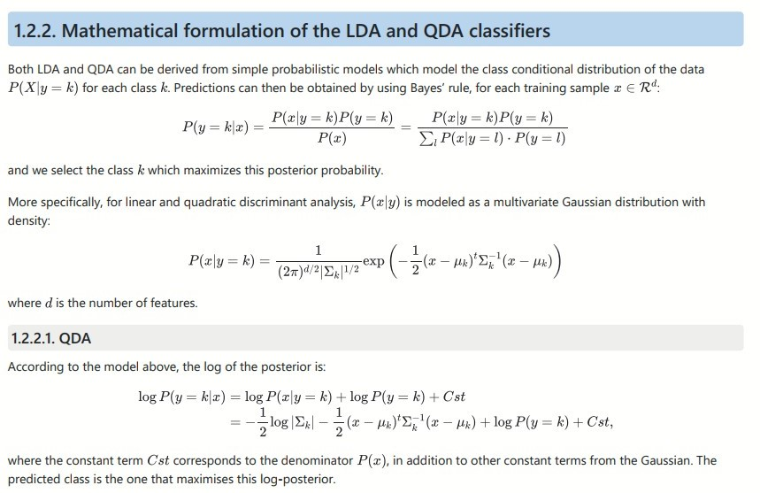
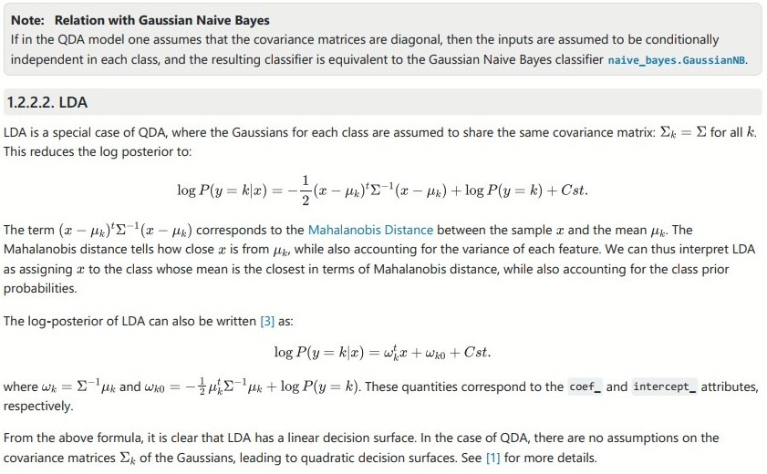
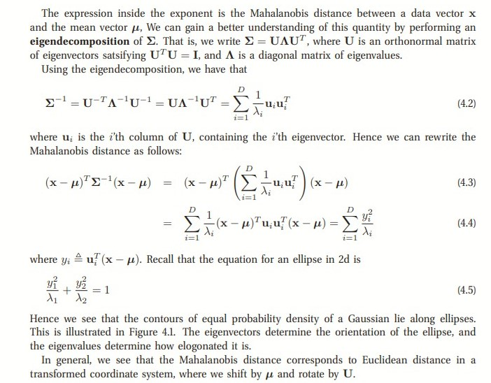
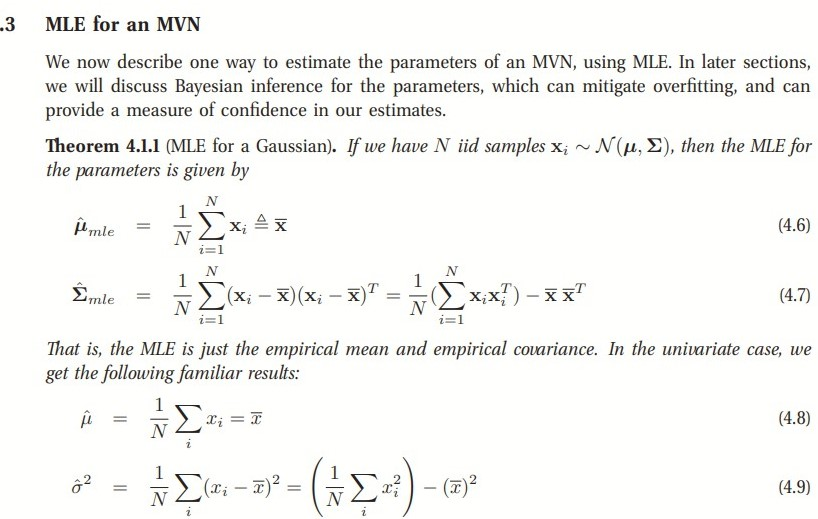

## Bayes' theorem

Bayes' theorem states that

$$ P(Y=k|X=x)= \frac{P(Y=k)P(X|Y=k)}{P(X)}  $$

$$OR$$

$$ P(Y=k|X=x)= \frac{P(Y=k)P(X|Y=k)}{\sum_{j}P(X=x|Y=j)P(Y=j)}  $$

$P(Y=k)$ is the prior probability and is the probability that a given observation is associated with the kth category of the response variable Y. If we have a random sample of Y's from the population then we find $P(Y)$ by computing the fraction of the training observations that belong to the kth class.

$P(Y=k|X=x)$ is the posterior probability, the probability of the observation belong kth class after seeing the observation.

$P(X=x|Y=k)$ called the likelihood . Given the response, what is the distribution of the inputs (the density function of X for an observation that comes from the kth class and has relatively large value if that observation is belongs to class k).

Suppose the response variable contain only two categories $0$and $1$then

$$P(X)=P(Y=0)P(X|Y=0)+ P(Y=1)P(X|Y=1)$$

$P(X)$ is the probability of the data under any hypothesis, called the normalizing constant (marginal probability)

## Discriminant analysis

Discriminant analysis is a fundamental classification method in statistical and probabilistic learning used to predict the probability of an observation belonging to a given class based the predictor variable(s). Compared to logistic regression, discriminant analysis is more suitable FOR multi-class (Target variable contains more than two classes) problems and is more stable than the logistic regression for multi-class classification problems

 

[Linear and Quadratic Discriminant Analysis](https://scikit-learn.org/stable/modules/lda_qda.html "Source")

# NOTE

$\mid \sum_{k} \mid$ is the determinant of the matrix $\sum_{k}$

## Covariance Matrix

  (Source: Machine Learning A Probabilistic Perspective By Kevin P. Murphy Page 98)

for more on LDA AND QDA and how they are derived read

[Linear and Quadratic Discriminant Analysis: Tutorial](https://arxiv.org/pdf/1906.02590.pdf)

[Fisher Linear Discriminant Analysis](https://www.ics.uci.edu/~welling/teaching/273ASpring09/Fisher-LDA.pdf)

[A Tutorial on Data Reduction Linear Discriminant Analysis (LDA)](http://www.sci.utah.edu/~shireen/pdfs/tutorials/Elhabian_LDA09.pdf)

[Linear Discriminant Analysis](http://homepages.cae.wisc.edu/~ece738/notes/LDAnotepr_l10.pdf)

# DATA

This data concern the prediction of a mortgage application approval based on 500000 observations with 22 features and a target variable (accepted) indicating whether a mortgage application was accepted or denied, based on a mortgage approval data adapted from the [Federal Financial Institutions Examination Council's (FFIEC)](https://www.ffiec.gov/hmda/hmdaflat.htm)

```{r}
library(caret)
library(tidyverse)
library(MASS)
```

```{r}
data=read.csv('data/train_values.csv',sep = ",")
label=read.csv('data/train_labels.csv',sep = ",")

```

```{r}
head(data,2)

```

```{r}
head(label,3)
```

```{r}
dim(data)

```

```{r}
nrow(data)
ncol(data)

```

concatenating the labels and the features while dropping the row\_id since it contains no information but only acting as identifier

```{r}
data=cbind(data[-1],label[-1])

```

```{r}
head(data,3)
```

# for simplicity we are dropping some columns

```{r}
data=data[,!names(data) %in% c('msa_md','county_code','minority_population_pct',      'ffiecmedian_family_income','occupancy','population' ,'state_code',
           'number_of_owner_occupied_units','tract_to_msa_md_income_pct','number_of_1_to_4_family_units' )]

```

```{r}
dim(data)
```

# drop observations containing missing values

```{r}
clean_data<-na.omit(data)
```

```{r}
dim(clean_data)
```

# correlation between numerical features

```{r}
cor(clean_data[,c('loan_amount','applicant_income', 'lender')])
```

```{}
```

# structure of the data

```{r}
str(data)

```

# 

from the displayed structure of the data, we can see that features like loan\_type, property\_type, etc are categorical(factor) variables which must be converted to their respective data type

# Categorical variables

```{r}
colu=c('loan_type','property_type', 'loan_purpose', 'preapproval' , 'applicant_ethnicity' ,'applicant_race' ,
       'applicant_sex' , 'co_applicant','accepted')

```

```{r}
head(clean_data[,colu],3)
```

# A function to convert the categorical variables to factors

```{r}
cat_factors<-function(dat,coll){
    for(i in coll){
        dat[i]<-factor(dat[[i]])
                }
    return (dat)
    
}

```

```{r}
clean_data=cat_factors(clean_data,colu)
```

```{r}
str(clean_data)
```

```{r}
table(clean_data$loan_type)

```

# Scaling numerical features

```{r}
num_feat<-c('loan_amount','applicant_income', 'lender')

```

```{r}
head(clean_data[num_feat])
```

```{r}
clean_data[num_feat]<-scale(clean_data[num_feat])
```

```{r}
head(clean_data[num_feat])
```

```{r}
indx<-clean_data$accepted %>% createDataPartition(p = 0.7,list = FALSE)
train<-clean_data[indx,]
test<-clean_data[-indx,]

```

```{r}
nrow(train)
nrow(test)
```

```{r}
lda_cl<-lda(accepted~.,data = train)
```

```{r}
lda_cl
```

the displayed LDA output indicates that the prior for $P(Y=0)=0.5023631$ impplying that 50.2% of the training observations correspond to application which were not accepted and \$P(Y=1)=0.4976369 \$ implying 49.8% of the training observations correspond to applications which were accepted.

```{r}
table(clean_data$loan_type)
```

The shows that for our categorical variables, we have one fewer feature than the number of levels in the original variable, for example, the loan\_type has four category but the result produced only three variables labeled loan\_type2, loan\_type3,loan\_type4. One class or category is set to zero 0 and we use the value of the intercept when interpreting the model using the estimated coefficients. z-statistic is analogous to the t-statistic that we encountered in linear regression. Higher Z-value for a feature is an indication that, that particular feature is significantly related to our output variable and their significant levels are confirmed by their associated p-values

```{r}
coef(lda_cl)
```

```{r}
plot(lda_cl)
```

```{r}
pred<-lda_cl %>% predict(newdata=test)
```

```{r}
names(pred)
```

```{r}
head(pred$class,10)
```

# Overall classification accuracy

```{r}
accuracy<-mean(test$accepted==pred$class)
accuracy
```

```{r}
error<-mean(test$accepted !=pred$class)
error
```

# Confusion matrix

```{r}
table(test$accepted,pred$class,dnn=c("Actual","Predicted"))
```

```{r}
table(test$accepted,pred$class,dnn=c("Actual","Predicted")) %>% prop.table() %>% round(digits =4)
```

```{r}
confusionMatrix(test$accepted,pred$class,dnn=c("Actual","Predicted"))
```

# Quadratic discriminant analysis - QDA

```{r}
qda_cl<-qda(accepted~.,data = train)
```

```{r}
pred_qda<-qda_cl %>% predict(newdata=test)
```

```{r}
names(pred_qda)
```

```{r}
head(pred_qda$class,10)
```

# Overall classification accuracy

```{r}
accuracy<-mean(test$accepted==pred_qda$class)
accuracy
```

```{r}
error<-mean(test$accepted !=pred_qda$class)
error
```

# Confusion matrix

```{r}
table(test$accepted,pred_qda$class,dnn=c("Actual","Predicted"))
```

```{r}
table(test$accepted,pred_qda$class,dnn=c("Actual","Predicted")) %>% prop.table() %>% round(digits =4)
```

```{r}
confusionMatrix(test$accepted,pred_qda$class,dnn=c("Actual","Predicted"))
```
